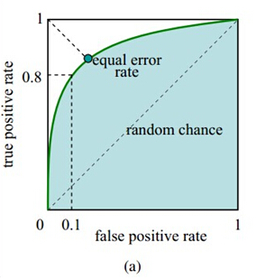
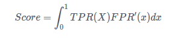

## 消费金融场景下的用户购买预测

#### 赛题背景

掌上生活APP是招商银行于2010年推出的手机客户端应用软件，全面升级了信用卡的使用体验。当前6.0版本的掌上生活APP，提供了手机商城、饭票影票、在线客服、基金理财、办卡开卡、额度管理、消费信贷、账单管理等全方位功能，同时实现了LBS查询服务和手机远程支付，全面满足并提升了持卡人对金融和日常生活需求的消费体验。

招商银行信用卡在不断拓展业务与场景的同时，也希望通过数据积累与数据驱动，主动捕捉用户价值信息与消费需求，发挥数据价值，给用户提供更加精准的服务。

#### 赛题任务

利用招商银行客户的个人属性、信用卡消费数据，以及部分客户在掌上生活APP上的一个月的操作行为日志，设计合理的特征工程与模型算法方案，预测客户在未来一周内（4月1日-7日），是否会购买掌上生活APP上的优惠券（包括饭票、影票等）。考虑到客户隐私，客户的个人属性数据与信用卡消费数据，采用脱敏并标准化处理为V1,V2,…,V30数值型属性。客户在APP上的行为日志，一些字段也进行了相应加密。

#### 数据背景

本次比赛提供的数据集包括训练数据与测试数据，训练数据共分为三部分：

（1）个人属性与信用卡消费数据：包含80000名信用卡客户的个人属性与信用卡消费数据，其中包含枚举型特征和数值型特征，均已转为数值并进行了脱敏和标准化处理。数据样例如下：

| USRID  | V1      | V2     | v3      | …    | V30     |
| ------ | ------- | ------ | ------- | ---- | ------- |
| 000001 | -1.2212 | 0.4523 | 1.3251  | …    | -1.2212 |
| 000002 | -1.0987 | 0.0165 | -1.0684 | …    | 0.0925  |

（2） APP操作行为日志：上述信用卡客户中，部分已绑定掌上生活APP的客户，在近一个月时间窗口内的所有点击行为日志。日志记录包含如下字段：

| 字段名  | 字段含义     | 说明                     |
| ------- | ------------ | ------------------------ |
| USRID   | 客户号       | 已匿名处理               |
| EVT_LBL | 点击模块名称 | 已清晰并编码             |
| OCC_TIM | 触发时间     | 用户触发该事件的精准时间 |
| TCH_TYP | 事件类型     | 0：APP,1：WEB,2：H5      |

其中，点击模块名称均为数字编码（形如231-145-18），代表了点击模块的三个级别（如饭票-代金券-门店详情）。

（3）标注数据：包括客户号及标签。其中，标签数据为用户是否会在未来一周，购买掌上生活APP上的优惠券。具体数据结构如下：

| 字段名 | 字段含义                      | 说明               |
| ------ | ----------------------------- | ------------------ |
| USRID  | 客户号                        | 已匿名处理         |
| FLAG   | 未来一周是否购买APP上的优惠券 | 0：未购买，1：购买 |

测试数据前两部分与训练数据相同，但不提供标注数据。

参赛选手不得在未经组委会授权情况下将比赛相关数据、材料作为其他用途使用，如经发现，组委会有权追究相关责任。

#### 文件清单和使用说明

> - train/ ——训练样本目录，包含三个文件
> - train_agg.csv —— 个人属性与信用卡消费数据
> - train_log.csv ——APP操作行为日志
> - train_flag.csv ——标注数据
> - test/ ——评测样本目录，包含两个文件，不提供标注数
> - test_agg.csv —— 个人属性与信用卡消费数据
> - test_log.csv—— APP操作行为日志

#### 评分方式

AUC(Area under Curve)：Roc曲线下的面积，介于0.1和1之间。Auc作为数值可以直观的评价分类器的好坏，值越大越好。在本赛题中我们选取AUC作为评价指标。现介绍如下：

1.混淆矩阵

对于一个二分类问题，混淆矩阵如下：

| 字段名 | 预测1 | 预测0 | 合计        |
| ------ | ----- | ----- | ----------- |
| 实际1  | TP    | FN    | TP+FN       |
| 实际0  | FP    | TN    | TP+TN       |
| 合计   | TP+FP | FN+TN | TP+FN+TP+TN |

- True negative(TN)，称为真阴率，表明实际是负样本预测成负样本的样本数
- False positive(FP)，称为假阳率，表明实际是负样本预测成正样本的样本数
- False negative(FN)，称为假阴率，表明实际是正样本预测成负样本的样本数
- True positive(TP)，称为真阳率，表明实际是正样本预测成正样本的样本数

通过上表我们可以计算一下两个值：

（1）真正类率(true postive rate， TPR)：TPR =  TP/(TP+FN)，代表分类器预测的正类中实际正实例占所有正实例的比例

（2）负正类率(false postive rate，FPR)：FPR =  FP/(FP+TN)，代表分类器预测的正类中实际负实例占所有负实例的比例

2.ROC曲线：

以FPR为横轴，以TPR为纵轴，变回获得如下图所示的ROC曲线。

3.AUC也就是上图中蓝色阴影的面积，计算公式如下：

#### 解决方案

> 详见奇点计划-决赛-我只吃两个剩下的都给你-解决方案.pdf

我们三个队友一起完成.
https://github.com/chenkkkk
https://github.com/FNo0

#### 运行说明

1.将训练集，测试集，提交样例放到data目录下(我保留了文件，但我将文件内容删除了，需要替换数据文件）

2.运行code/chenzhiliang.py   运行环境xgboost0.6

3.运行code/gao.py          运行环境xgboost0.71

4.运行code/zhao.py      运行环境xgboost0.6

5.运行code/fusion.py ,最终结果文件big_fusion_7_14_ratio1.35_18_1.1.txt

方案整理的不够详细，如果有什么疑问，可以按照github上邮箱进行联系972913434@qq.com
